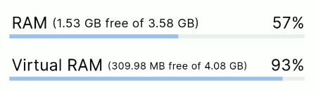

# system_info3
system_info3 provides easy access to essential system information, including details about your system's architecture, kernel, memory, operating system, CPU, and user environment.

This is a fork of system_info2, maintained after the original author stepped down. Thanks to the previous contributors for their work on the original package.

With system_info3, you can easily retrieve key hardware and OS characteristics, such as:

- [x] Kernel architecture
- [x] Kernel bitness          
- [x] Kernel name             
- [x] Kernel version          
- [x] Operating system name   
- [x] Operating system version
- [x] User directory          
- [x] User id                 
- [x] User name               
- [x] User space bitness      
- [x] Physical memory and swap details
- [x] CPU information


## Getting Started
1. Install the package

Dart
```bash
dart pub add system_info3
```

Flutter
```bash
flutter pub add system_info3
```

2. Import the package

```dart
import 'package:system_info3/system_info3.dart';
```

3. Use the package

Example
```dart

if (SysInfo.operatingSystemName == "Ubuntu") {
  log.info("We love Ubuntu users");
}
```

## Screenshot



## Compatibility
- [x] Windows
- [x] Linux
- [x] MacOS
- [x] Android
- [ ] iOS

# Usage

This package provides various system information like kernel details, operating system information, CPU specifications, and memory statistics. Below is a guide on how to use the package in different categories.
Refer to the API documentation for more details on the available classes and methods.

## 1. Kernel Information

You can retrieve details about the system's kernel architecture, version, and other kernel-related information.

```dart
import 'package:system_info3/system_info3.dart';

void main() {
  print('Kernel architecture     : ${SysInfo.kernelArchitecture}');
  print('Raw Kernel architecture : ${SysInfo.rawKernelArchitecture}');
  print('Kernel bitness          : ${SysInfo.kernelBitness}');
  print('Kernel name             : ${SysInfo.kernelName}');
  print('Kernel version          : ${SysInfo.kernelVersion}');
}
```

### Available Kernel Information:
- `kernelArchitecture`: The architecture of the kernel (e.g., `x86_64`, `arm64`).
- `rawKernelArchitecture`: The raw architecture of the kernel.
- `kernelBitness`: The bitness of the kernel (e.g., 32-bit or 64-bit).
- `kernelName`: The name of the kernel (e.g., `Linux`, `Darwin`).
- `kernelVersion`: The version of the kernel.

## 2. Operating System (OS) Information

You can get details about the operating system, user information, and the system's user environment.

```dart
import 'package:system_info3/system_info3.dart';

void main() {
  print('Operating system name   : ${SysInfo.operatingSystemName}');
  print('Operating system version: ${SysInfo.operatingSystemVersion}');
  print('User directory          : ${SysInfo.userDirectory}');
  print('User id                 : ${SysInfo.userId}');
  print('User name               : ${SysInfo.userName}');
  print('User space bitness      : ${SysInfo.userSpaceBitness}');
}
```

### Available OS Information:
- `operatingSystemName`: The name of the operating system (e.g., `Windows`, `Linux`, `macOS`).
- `operatingSystemVersion`: The version of the operating system.
- `userDirectory`: The directory of the current user.
- `userId`: The ID of the current user.
- `userName`: The name of the current user.
- `userSpaceBitness`: The bitness of the user space (32-bit or 64-bit).

## 3. CPU Information

This section provides details about the CPU, such as the number of cores and their specific characteristics.

```dart
import 'package:system_info3/system_info3.dart';

void main() {
  final cores = SysInfo.cores;
  print('Number of cores    : ${cores.length}');
  for (final core in cores) {
    print('  Architecture          : ${core.architecture}');
    print('  Name                  : ${core.name}');
    print('  Socket                : ${core.socket}');
    print('  Vendor                : ${core.vendor}');
  }
}
```

### Available CPU Information:
- `cores`: A list of CPU cores with details such as architecture, name, socket, and vendor.
    - `architecture`: The architecture of the core (e.g., `x86_64`, `arm`).
    - `name`: The name of the CPU core (e.g., `Intel(R) Core(TM) i7-9700K`).
    - `socket`: The socket number where the core resides.
    - `vendor`: The vendor of the CPU (e.g., `Intel`, `AMD`).

## 4. Memory/RAM Information

This section shows the total and free physical and virtual memory available on the system.

**Note:**: `getFreePhysicalMemory()` returns memory that is not in use but may not be immediately available for allocation. `getAvailablePhysicalMemory()` returns memory that can be reclaimed and is ready for use.
This distinction is only relevant on Linux and Android. On MacOS and Windows the two values are the same.

```dart
import 'package:system_info3/system_info3.dart';

void main() {
  const int megaByte = 1024 * 1024;
  
  print('Total physical memory   : ${SysInfo.getTotalPhysicalMemory() ~/ megaByte} MB');
  print('Free physical memory    : ${SysInfo.getFreePhysicalMemory() ~/ megaByte} MB');
  print('Available physical memory: ${SysInfo.getAvailablePhysicalMemory() ~/ megaByte} MB');
  print('Total virtual memory    : ${SysInfo.getTotalVirtualMemory() ~/ megaByte} MB');
  print('Free virtual memory     : ${SysInfo.getFreeVirtualMemory() ~/ megaByte} MB');
  print('Virtual memory size     : ${SysInfo.getVirtualMemorySize() ~/ megaByte} MB');
}
```

### Available Memory Information:
- `getTotalPhysicalMemory()`: Returns the total physical memory in bytes.
- `getFreePhysicalMemory()`: Returns the free physical memory in bytes.
- `getTotalVirtualMemory()`: Returns the total virtual memory in bytes.
- `getFreeVirtualMemory()`: Returns the free virtual memory in bytes.
- `getVirtualMemorySize()`: Returns the virtual memory size in bytes.

**Note:** The memory values are returned in bytes. The example code converts them to megabytes for easier reading.

Check out the [example](https://pub.dev/packages/system_info3/example) for a complete implementation. Run the example using the following command:
```bash
dart example/example.dart
```

## Additional information
Report issues and help improve the package on [GitHub](https://github.com/dev-kasibhatla/system_info3/issues).
Check [API reference](https://pub.dev/documentation/system_info3/latest/) for more detailed information.
